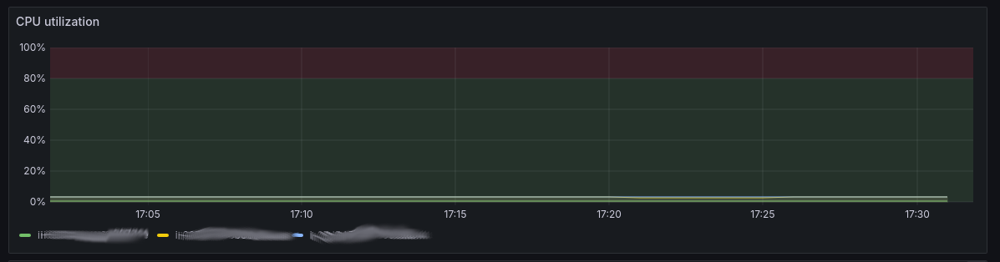
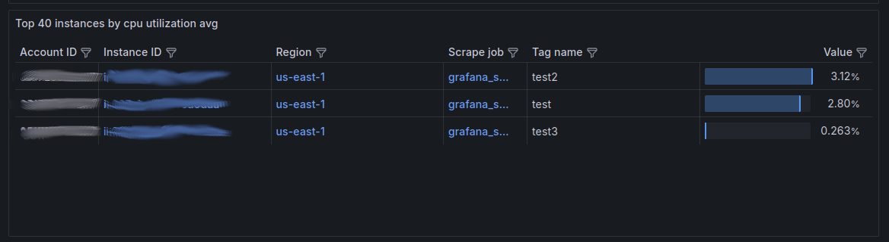

# Brief study of cost and performance of EC2 instances using turn-key solutions in Grafana and AWS

There are many things to consider in [MLOps and the ML lifecycle](https://aws.amazon.com/what-is/mlops/). Looking at using EC2 instances for training models in the AWS ecosystem, two obvious concerns arise around cost and performance. EC2 can get expensive, so the inclination is to choose an instance that is less powerful; however, the trade-off is speed. Since speed is important for software companies, the answer is a compromise, in this example, to find a cheap enough instance that will train the model fast enough. Dashboards help all sorts of users to visualize machine performance, with Grafana being a popular choice.

## Grafana prioritizes the cloud

Grafana built a [CloudWatch integration](https://grafana.com/blog/2021/11/17/2021/11/17/grafana-aws-cloudwatch-integration/). Grafana users can easily access information on their AWS services
with a bit of configuration. For EC2, Grafana provides the following metrics:
- EC2 cpu credit balance
- EC2 cpu credit usage
- EC2 cpu surplus credit balance
- EC2 cpu surplus credits charged
- EC2 cpu utilization
- EC2 dedicated host cpu utilization
- EC2 disk read bytes
- EC2 disk read ops
- EC2 disk write bytes
- EC2 disk write ops
- EC2 ebs byte balance percentage
- EC2 ebs io balance
- EC2 ebs read bytes
- EC2 ebs read ops
- EC2 ebs write bytes
- EC2 ebs write ops
- EC2 network in
- EC2 network out
- EC2 network packets in
- EC2 network packets out
- EC2 status check failed
- EC2 status check failed attached ebs
- EC2 status check failed instance
- EC2 status check failed system

With additional configuration, Grafana can take those metrics and turn them into dashboards. In the EC2 dashboard, panels display how instances are performing based on a specific metric.

## Finding the bottleneck

Some obvious cues when troubleshooting a machine's performance are immediately observable simply by looking at the dashboard. For example, cpu usage has reached its maximum. Other times, the dashboard will need further configuration to support an engineer in trying to improve a machine's performance. Perhaps historical benchmarks can indicate unusual slowness. Grafana allows graphs to be configured with thresholds, and here is what a display of cpu utilization with an acceptable threshold of 80% looks like.

Some common scenarios arise when analysing metrics:
- one or more bottlenecks, as in system performance will not improve unless those bottlenecks are relieved
- no bottlenecks, but there are multiple factors that will improve performance, each factor having its own price tag

Even after determining which factor(s) cause a machine to be slow, the next question is "how much to improve the system". Perhaps the dashboard might provide enough information to answer that question, but the engineer still might want to verify their hypothesis.

## Fast and cheap experiments

In our example, the engineer wants to ensure that cpu usage is below a certain threshold. Next, the engineer might provision a t4g.large (2 cores), a t4g.xlarge (4 cores), and a t4g.2xlarge (8 cores), running their training on each of those machines. This experiment can validate:
- is 4 cores enough
- is 8 cores too much
- other considerations

Realistically, machines are using many more cores for training. AWS even offers machines with 448 vcpus. The point of this example is to illustrate the types of questions that could be asked when rightsizing a machine. Grafana has a 'Rightsizing' section for AWS to compare performance, ranking the machines by metric for the user.

If too many machines outside of the experiment are being listed, Grafana allows users to filter the table by tag and/or name.

## Finops is hard

Grafana has a [pre-built aws billing dashboard](https://grafana.com/docs/grafana-cloud/monitor-infrastructure/monitor-cloud-provider/aws/cloudwatch-metrics/metric-dashboards/aws-billing-dashboard/), but it doesn't seem to support granularity at the level of specific EC2 instances when analysing cost.

In the AWS billing dashboard, historical costs can be sorted by tags, which is useful when more than one service is required. For example, if an EBS volume is attached to an EC2 instance for training a model, tagging both resources gives a cumulative cost. However, billing costs organized by tags are only available at the [end of the billing cycle](https://docs.aws.amazon.com/awsaccountbilling/latest/aboutv2/cost-alloc-tags.html). Even configuring AWS billing to [improve granularity by the hour](https://docs.aws.amazon.com/cost-management/latest/userguide/ce-granular-data.html), it only presents cost grouped by type of aws service, but not by instance id nor tag. For a manual approach to cost, AWS provides [pricing for EC2 instances along with their specs](https://aws.amazon.com/EC2/pricing/on-demand/).

Finally, if the budget allows, test instances can be left running until training is complete. That way, a definitive view of cost and time taken is available at the end of the experiment. This information is particularly useful if companies train their models under similar conditions most or all of the time.

## Final notes

By using turnkey dashboards offered by grafana and aws, an engineer can quickly form a hypothesis and quickly run a subsequent experiment to confirm their guess. The turnkey solution from Grafana is good for evaluating performance but not for cost. Existing solutions are suitable for answering, "what's better" or "what's cheaper"; however, definitive answers around "will this fit the budget" or "will we make the deadline" are unlikely to be answered with the solutions discussed.
